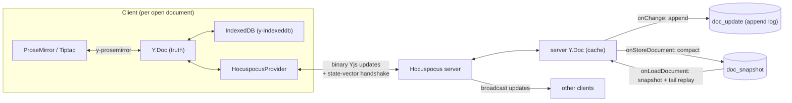

# Collaboration & CRDT Correctness Contract

> This document is the **authoritative statement** of what Scribe's collaboration layer
> guarantees, what it deliberately does **not** guarantee, and which synchronization
> patterns are **forbidden**. It is the contract every future change to the sync layer
> must keep. It complements — and does not replace — [realtime-collaboration.md](realtime-collaboration.md),
> [offline-sync.md](offline-sync.md), [persistence.md](persistence.md), and
> [connection-states.md](connection-states.md); where those describe _how_, this states
> the _invariants_ and the _proof_.
>
> It was produced by the Phase 13 collaboration audit, which re-read the entire
> synchronization lifecycle against the graded correctness requirements and proved each
> guarantee with a real (non-mocked) test. Where the audit found a genuine boundary, it is
> recorded here honestly rather than papered over.

## 1. The one invariant everything else serves

> **Document content is NEVER merged by replacing one document with another.**
> Yjs is the single source of truth for collaborative document state, end to end.

Content only ever moves as **binary Yjs updates**. It is never serialized to HTML or
ProseMirror JSON and sent as "the document", never chosen between by timestamp, and never
overwritten on reconnect. Every other rule below is a consequence of this one.

## 2. The layers and their exact roles

| Layer                  | Component                                      | Role in the contract                                                                                        |
| ---------------------- | ---------------------------------------------- | ----------------------------------------------------------------------------------------------------------- |
| **CRDT (truth)**       | **Yjs** `Y.Doc` / `Y.XmlFragment`              | The authoritative document state. All convergence, idempotence, and intention semantics come from here.     |
| **Editor projection**  | **ProseMirror / Tiptap**                       | A _view_ of the Yjs document. `y-prosemirror` keeps them in lock-step. The editor never owns content.       |
| **Transport / server** | **Hocuspocus** (client + server)               | Moves updates and runs the state-vector handshake. The server Y.Doc is a **cache**, not a second truth.     |
| **Local durability**   | **IndexedDB** via `y-indexeddb`                | Per-browser persistent copy of the Yjs state, so offline edits survive reload/restart and re-offer on sync. |
| **Durable store**      | **PostgreSQL** (`doc_update` + `doc_snapshot`) | The durable persistence of Yjs **updates** and **snapshots** — binary only, never parsed content.           |

Layer numbering (Layer 1 = schema, Layer 2 = Y.Doc, Layer 3 = transport) follows
[system-overview.md](system-overview.md).

**Everything is one CRDT mechanism.** Text, bold/italic/underline **marks**, `textAlign`
**attributes**, headings, bullet/ordered **lists**, hard breaks, and the **`pageBreak`**
node are all ordinary nodes/marks/attributes in the _shared_ ProseMirror schema
(`packages/shared/src/editor.ts`). Because the schema is shared, the server seeds and
reconstructs documents with the exact same schema the browser uses, so all of these ride
the identical Yjs pipeline. There is **no** separate synchronization path for page breaks,
formatting, or structure.

## 3. What "conflict-free" means here

"Conflict-free" is a precise, technical claim — three CRDT guarantees:

- **G1 — Convergence.** Any two replicas that have applied the same set of updates are
  byte-identical, regardless of the order in which they applied them.
- **G2 — Idempotence.** Applying an update twice equals applying it once. Duplicate or
  re-sent updates cannot corrupt state.
- **G3 — Intention preservation.** Concurrent edits are _both_ retained and
  deterministically ordered; none is silently dropped or overwritten. There is no
  last-write-wins.

It also means, operationally: **no lost acknowledged update, no divergent CRDT state, no
manual conflict dialog, and no LWW overwrite.**

## 4. What the CRDT does NOT guarantee (stated honestly)

- **It does not infer human semantic intent.** If two people make _semantically
  incompatible_ edits to the _exact same_ content, the CRDT produces a single deterministic,
  converged result — not the one a human would have hand-picked. This is correct CRDT
  behavior, not a defect. Convergence is guaranteed; "the answer a person wanted" is not.
- **`y-prosemirror` structural-replace boundary (measured, not theoretical).** A
  ProseMirror operation that _replaces_ a block (e.g. wrapping a paragraph into a list)
  is translated by `y-prosemirror` into delete-and-reinsert of that block's subtree. If a
  concurrent offline edit _inserts adjacent content anchored to that same block_, the two
  operations can converge to a state that keeps the structural change but not the adjacent
  insert. **Convergence (G1) still holds** — both replicas are identical, there is no
  divergence and no LWW — but intention preservation (G3) can be incomplete for this
  specific same-block structural-vs-insert case. Edits in **different regions** preserve
  both intentions fully. This is an upstream `y-prosemirror` mapping limitation, documented
  here rather than hidden; it is exercised (and its safe different-region counterpart
  proven) in `apps/web/e2e/collab-structural-convergence.spec.ts`.
- **It is not durable by itself.** Durability is a property of the persistence layer, with
  the exact boundary stated in §8.

## 5. Prohibited synchronization patterns (the forbidden list)

These must never appear in the sync path. A change that introduces any of them violates the
contract:

- ❌ **LWW document replacement** — choosing a "winner" document and discarding the other.
- ❌ **`editor.setContent(remoteDocument)` as synchronization** — pushing a whole document
  into the editor to "catch up". (`setContent` is not used anywhere in the sync path.)
- ❌ **Replacing the local `Y.Doc` with server JSON** on reconnect or at any time.
- ❌ **Merging two ProseMirror JSON trees by hand.**
- ❌ **Choosing a winner using `updated_at`** or any timestamp/version comparison for
  content.
- ❌ **Discarding an offline document because the server's copy is "newer".**
- ❌ **Storing rendered content (HTML/JSON) as a second source of truth** — in
  `localStorage`, in a DB column, anywhere. (The only `localStorage` use is a tiny
  _metadata_ cache — `{id, title, role, timestamps}` — never content; see
  [offline-sync.md](offline-sync.md#deviation-a-tiny-metadata-cache-for-offline-document-open).)
- ❌ **A client-side `readOnly` flag as the authorization boundary** (see §7).
- ❌ **A separate state channel for page breaks or formatting.**
- ❌ **Redis / Kafka / a second CRDT / microservices** — the design is a single-process
  modular monolith by decision (ADR-0006).

## 6. Lifecycle guarantees

### 6.1 Normal edit (online)

`keystroke → ProseMirror transaction → y-prosemirror → local Y.Doc update → (a) y-indexeddb
persists locally AND (b) provider sends the binary update → Hocuspocus applies to server
Y.Doc → onChange appends to doc_update → broadcast to peers → peers' Y.Doc merge → their
ProseMirror re-renders.` Local application is synchronous and never blocked by the network.

### 6.2 Reconnect / offline-return

Reconnect is a **bidirectional state-vector diff**, never a push of "my version":

1. Client sends its state vector; server sends its state vector.
2. Each side computes `Y.encodeStateAsUpdate(doc, otherStateVector)` — exactly the updates
   the other is missing — and sends only that diff.
3. Both sides `Y.applyUpdate` the diff. The offline client's edits go _up_; the peers'
   concurrent edits come _down_; the CRDT merges both directions.

There is no whole-document replacement at any point. Because the diff is computed from the
_full_ server Y.Doc state (reconstructed from snapshot + tail, §8), a client that has been
offline for a long time can always resynchronize even after the server has compacted its
update log — the snapshot is the full CRDT state, not a lossy summary.

### 6.3 Out-of-order and duplicate delivery

Handled by Yjs itself (G1/G2). Updates carry the client/clock metadata Yjs needs to order
them structurally, so delivery order is irrelevant, and a re-delivered update is a no-op.
The application adds **no** custom ordering or deduplication layer, because Yjs already
provides these — adding one would be redundant and risky.

### 6.4 Server restart

The in-memory server Y.Doc is a cache. On the next connection, `onLoadDocument` rebuilds it
from Postgres (§8) and the handshake proceeds normally. The client's IndexedDB is the
safety net for any update received-but-not-yet-persisted at the instant of a crash.

### 6.5 Undo / redo

Undo/redo is Tiptap's `Collaboration` extension backed by a Yjs `UndoManager`, scoped to
the local user's own changes. StarterKit's local history is disabled so there are never two
competing history stacks. Undo therefore undoes _the local user's_ operations as Yjs steps;
it never restores a whole-document snapshot and never reverts unrelated remote changes.

## 7. Authorization boundary (server-authoritative)

**Being able to open a Y.Doc is not authorization to modify it.** The security boundary is
on the server, in this exact order (per connection):

1. **Authenticate** — `onAuthenticate` verifies the short-lived JWT access token. (WS auth
   uses only the access token, never the refresh token.)
2. **Authorize** — the same membership repository the REST API uses
   (`getDocumentForUser`) decides the role. Non-membership and non-existence are
   indistinguishable (both reject), mirroring REST 404-on-forbidden.
3. **Writable / read-only** — a `viewer` connection is marked `connection.readOnly = true`;
   Hocuspocus **rejects inbound document updates** from it server-side.
4. **Update acceptance** — only then are updates applied/persisted/broadcast.

A viewer that bypasses the UI and writes directly to its local `Y.Doc` produces updates the
server **drops** — the edit never reaches Postgres or other peers. Permission changes are
live: changing/revoking a role over REST force-drops the affected socket with a non-terminal
close code, so it reconnects and re-runs `onAuthenticate` against the current membership —
closing any authorization gap **without** disturbing other collaborators and **without**
any document replacement (content resyncs via the normal handshake). The client-side
`readOnly`/`editable` flag is **UX only**; it is never the security boundary.

## 8. Persistence & durability semantics (the exact boundary)

**Model:** hybrid append-log + snapshot (ADR-0005, [persistence.md](persistence.md)).

- `onChange` **appends** each incoming binary update to `doc_update` **synchronously** in
  the change path. This is the durability write.
- `onStoreDocument` **compacts**: it reads the current max `seq`, encodes the full state,
  then writes one `doc_snapshot` and deletes `doc_update` rows with `seq <= through_seq` —
  all in **one transaction**. Reading the max seq _before_ encoding guarantees the snapshot
  always includes everything it claims to (`through_seq`), so a compaction can never delete
  an update the snapshot does not contain.
- `onLoadDocument` reconstructs the Y.Doc as `snapshot + replay(updates where seq >
through_seq)`, or seeds a blank document once if nothing is persisted.

**Proven invariant:** `snapshot + tail replay` reconstructs the **byte-identical** Y.Doc
(state-vector equality) that the full update history would — verified in
`apps/server/test/integration/persistence.test.ts`. Compaction is safe for long-offline
clients because the snapshot is the complete CRDT state.

**The honest durability boundary (single-instance Postgres):**

| Stage                          | Guarantee                                                                                          |
| ------------------------------ | -------------------------------------------------------------------------------------------------- |
| Local update created           | Applied to the in-memory Y.Doc synchronously; rendered immediately.                                |
| Stored in IndexedDB            | Durable **on this device**; survives reload/restart/offline.                                       |
| Sent to server                 | In flight; no durability implied.                                                                  |
| Accepted by server             | Applied to the server Y.Doc **and broadcast to peers** — this happens _before_ the Postgres write. |
| Persisted (onChange committed) | Durable in Postgres. This is the real durability point.                                            |

**We do not overclaim.** Because Hocuspocus applies+broadcasts before `onChange` commits,
there is a narrow window where an update is visible to peers but not yet in Postgres. If the
process dies inside that window, that specific update is not in the server's durable store —
but it is **not lost to the system**: it remains in the originating client's IndexedDB (and
any peer's), and the reconnect handshake re-offers it. This is the truthful guarantee of a
single-instance PostgreSQL deployment; we deliberately do not claim stronger
(e.g. synchronous-replication / quorum) semantics the deployment cannot provide.
`onChange`/`onStoreDocument` never reject on failure — a persistence error is logged
(without content) and must not tear down a live connection, because the client's local copy
plus reconnect is the recovery path.

## 9. Correctness matrix (scenario → expected → proof)

Every row is proven by a **real, non-mocked** test: real Fastify + Hocuspocus over a real
WebSocket, real independent `Y.Doc`s + providers, real Postgres, and — at the E2E layer —
real Chromium, real IndexedDB, and Playwright's real network-offline control. Convergence
is asserted as a **property** (equal Yjs state vectors ⇒ identical document, or identical
canonical logical JSON in the browser), never a hand-picked winning string.

| Scenario                          | Expected result                                                         | Test coverage                                                                                                    |
| --------------------------------- | ----------------------------------------------------------------------- | ---------------------------------------------------------------------------------------------------------------- |
| Online + online                   | Both directions propagate; converge; no full-doc replacement            | `server/test/integration/collab.test.ts` (A→B / B→A, concurrent); `web/e2e/offline.spec.ts` (live)               |
| Online + offline (A off, B on)    | On reconnect both edits merge; neither overwrites                       | `integration/offline.test.ts` "Scenario B"; `e2e/offline.spec.ts` "offline editing … survives reconnect"         |
| Offline + offline                 | Both diverge from a base; converge; both survive                        | `integration/offline.test.ts` "Scenario C", "§8", "§9"; `e2e/offline.spec.ts` "both offline diverge"             |
| Reconnect order A→B               | Order-independent convergence                                           | `integration/offline.test.ts` "Scenario C" / "§32"                                                               |
| Reconnect order B→A               | Same converged result; later reconnect never wins (no LWW)              | `integration/offline.test.ts` "§32"; `e2e/offline.spec.ts` (A first) / `collab-structural-convergence` (B first) |
| Out-of-order updates              | Yjs orders structurally; final state equivalent                         | Yjs property; exercised across all merge tests (updates arrive interleaved)                                      |
| Duplicate update                  | Idempotent; no corruption, no doubling                                  | `integration/collab.test.ts` "replaying the same … idempotent"; `integration/offline.test.ts` "§10"              |
| Disconnect during sync / flapping | Recovers; no loss, no duplication; edits never blocked                  | `integration/offline.test.ts` "§10 repeated flapping"                                                            |
| Server restart                    | State rebuilt from Postgres; clients converge; future edits work        | `integration/collab.test.ts` "survives a full server restart"; `integration/offline.test.ts` "§12"               |
| Browser refresh offline           | Local (IndexedDB) edits survive reload; resync on return                | `e2e/offline.spec.ts` "an offline edit survives a browser reload"                                                |
| Page-break merge                  | Page breaks converge; no nested/ malformed break                        | `e2e/page-break-editing.spec.ts` (2-collaborator + offline); `web/src/features/editor/DocumentEditor.test.tsx`   |
| Formatting merge                  | Marks + `textAlign` converge structurally                               | `e2e/formatting.spec.ts` "Scenario C"; `e2e/collab-structural-convergence.spec.ts`                               |
| Undo/redo after merge             | Local-scoped Yjs undo; no whole-doc snapshot restore; remote edits kept | `Collaboration` UndoManager; `web/src/features/editor/DocumentEditor.test.tsx`                                   |
| Permission change during collab   | Live re-auth; authorized users undisturbed; content preserved           | `integration/permissions.test.ts` (viewer→editor, editor→viewer, remove, no-disturb)                             |
| Unauthorized update attempt       | Server rejects a read-only connection's updates (UI-bypass)             | `integration/collab.test.ts` "viewer … rejects their edits"; `integration/ws-security.test.ts`                   |
| Snapshot + tail replay            | Byte-identical reconstruction; compaction loses nothing                 | `integration/persistence.test.ts` (all three cases)                                                              |
| Structural convergence (browser)  | Marks/attrs/page-breaks/lists converge, not just text                   | `e2e/collab-structural-convergence.spec.ts`                                                                      |

## 10. Convergence assertions (how we compare, not just claim)

- **Server / integration:** convergence is **equal Yjs state vectors**
  (`Y.encodeStateVector`) ⇒ identical documents, via `waitUntilConverged` in the offline
  suite, plus a human-readable text cross-check. We compare **logical** state vectors, not
  raw binary updates (the same logical state can have different binary encodings).
- **Browser / E2E:** two levels. `expectConverged` compares visible text (cursor widgets
  stripped). `expectStructurallyConverged` compares the **canonical logical document JSON**
  — `editor.getJSON()`, exposed by a dev-only probe (`collabDiagnostics.ts`) — which carries
  marks, node attributes, `pageBreak` nodes, and list structure, while excluding client-only
  pagination decorations and remote cursors. This detects structural divergence that a
  text-only check would miss. The probe is compiled only into dev builds, never mutates the
  editor or Y.Doc, and never exposes content in production.

## 11. Diagnostics (test-only)

On a convergence failure the suites report enough to find the cause without logging content
in production: the offline integration suite dumps each doc's **state vector** and rendered
text on timeout; the browser probe exposes canonical JSON for a structural diff. Production
structured logs record collaboration lifecycle events (auth/authorization result, connection
open/close, persistence failures, permission-driven disconnect) **by document/user id
only** — never document text, tokens, or secrets (see [security.md](security.md)).

## 12. Known limitations (honest)

1. **`y-prosemirror` structural-replace vs. same-block adjacent insert** — §4. Convergence
   holds; intention preservation can be incomplete for this specific case. Different-region
   edits are unaffected.
2. **Durability window** — §8: a single update can be broadcast before it is committed to
   Postgres; recovery is via client IndexedDB + reconnect, not server durability, in that
   window. Truthful for a single-instance deployment.
3. **Offline app-shell reload** — CRDT _content_ survives an offline reload (IndexedDB), but
   re-fetching the HTML/JS bundle while still offline needs a service-worker/PWA app-shell
   cache, which is out of MVP scope ([offline-sync.md](offline-sync.md#known-limitation-app-shell-offline-reload)).
4. **Offline document _creation_** — a document must be created online (needs a server id +
   membership) before offline editing; creating brand-new documents offline is future work.
5. **Single Postgres instance** — no cross-node durability/replication guarantees are
   claimed; the model is a modular monolith by decision (ADR-0006/0008).
