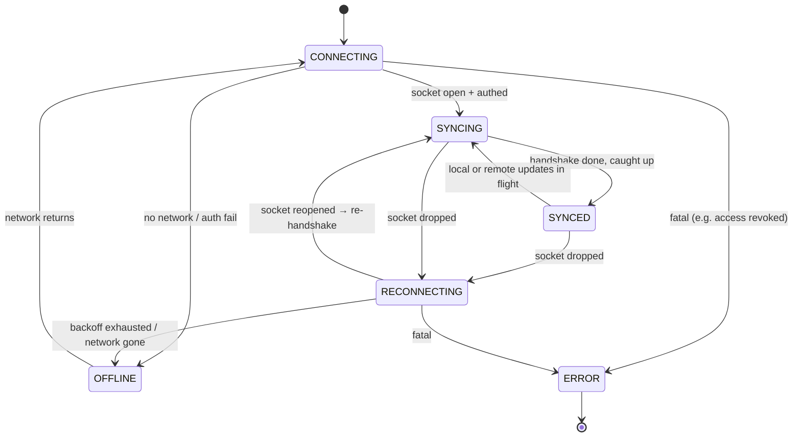

# Connection & Sync State Machine

The UI concept has a "Synced to cloud" / "Offline storage ready" indicator. Behind it is a
real state machine. **The governing rule: a temporary network problem must never lose the
user's local edits.** In every state, keystrokes are applied to the local `Y.Doc` and
persisted to IndexedDB first; the state only describes the _remote_ relationship.

## States

We keep six states — each is distinguishable to the user and drives a different label; we
resisted adding more because extra states with identical behavior are noise.

| State          | Meaning                                  | What happens to edits                       | UI signal (per design system)                                   |
| -------------- | ---------------------------------------- | ------------------------------------------- | --------------------------------------------------------------- |
| `CONNECTING`   | Opening socket / authenticating          | Editable; buffered locally                  | subtle "Connecting…"                                            |
| `SYNCING`      | Exchanging updates (initial or catch-up) | Editable; updates flowing both ways         | "Syncing…"                                                      |
| `SYNCED`       | Local == remote, live                    | Editable; instant propagation               | "Synced to cloud" (calm/positive)                               |
| `OFFLINE`      | No connection, by choice or failure      | **Fully editable; queued in IndexedDB**     | "Offline — changes saved locally" (informational, not alarming) |
| `RECONNECTING` | Was connected, retrying w/ backoff       | **Fully editable; queued**                  | "Reconnecting…"                                                 |
| `ERROR`        | Fatal, non-retryable (auth/access)       | Editable locally; won't sync until resolved | clear error + action (e.g. re-login)                            |

## Design rules the state machine enforces

- **Editing is never blocked.** There is no state in which the editor is read-only due to
  the network. Only an authorization loss (`ERROR`) or an explicit `viewer` role makes it
  read-only, and that is a permission fact, not a network fact.
- **State is derived, not commanded.** The provider's socket + sync events drive the state;
  the UI subscribes. This prevents the UI and the sync engine from disagreeing.
- **Transitions are debounced for calm.** Brief `SYNCED → SYNCING → SYNCED` flickers during
  normal typing are smoothed so the indicator doesn't strobe; only sustained changes surface.
- **Offline is not an error.** `OFFLINE` is styled as neutral/positive ("saved locally"),
  reflecting that offline is a first-class supported mode, not a failure.

## Error handling beyond the socket

- **Auth expiry mid-session:** access token refreshed via the refresh cookie; if refresh
  fails → `ERROR` with a re-login prompt, local edits preserved and flushed after re-auth.
- **Malformed/rejected update from server:** the client logs and re-runs the sync handshake
  rather than tearing down the doc; the CRDT stays valid because updates are validated
  before apply (see [security.md](security.md)).
- **IndexedDB write failure:** surfaced as a non-blocking warning that offline durability is
  degraded; the session continues in memory.

## Implementation (Phase 3)

The machine is implemented as a **pure derivation** in
`apps/web/src/features/collaboration/connectionState.ts#deriveConnectionStatus`, so
every row of the table above is unit-tested (`connectionState.test.ts`) without a
socket. `useCollaboration.ts` feeds it live signals and pushes the result into the UI
store, which the header `StatusPill` renders.

The derivation combines two independent signals to keep the label truthful:

1. the `HocuspocusProvider` socket/sync events (`connecting` / `connected` / `synced`
   / `disconnected`), and
2. the browser's own `navigator.onLine` plus `online`/`offline` window events.

Precedence (see the function): `ERROR` (fatal auth) → **`OFFLINE` when
`navigator.onLine` is false** → `SYNCED`/`SYNCING` when the socket is connected →
`RECONNECTING` (had a prior connection) / `CONNECTING` (first attempt) otherwise.
Checking `navigator.onLine` **before** the connected branch is deliberate: it
guarantees the UI can never show "Synced to cloud" while the browser has no network,
even in the brief window before the socket notices it dropped. A server outage while
the browser still has network is therefore `RECONNECTING`, not `OFFLINE` — the
distinction the offline matrix (§ "server unavailable vs network offline") requires.
