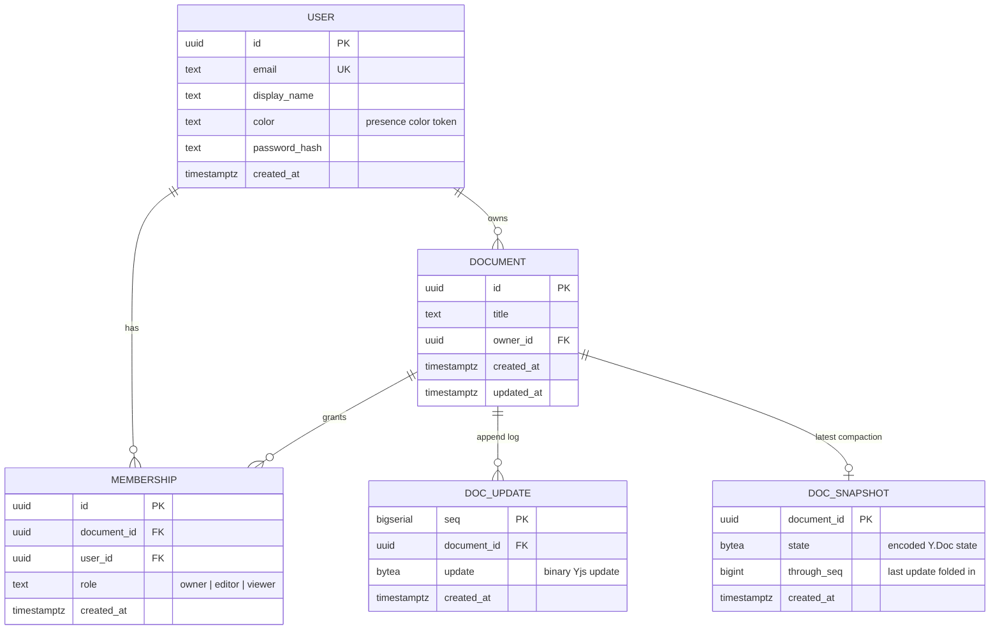

# Data Model

The domain is intentionally small — the assignment is about collaborative editing, not
business modules. Two clear categories:

- **Durable (Postgres):** users, documents, memberships, and the CRDT state (updates +
  snapshots).
- **Ephemeral (never in Postgres):** presence/awareness and live socket sessions. These
  live only in server memory / on the wire and expire on disconnect.

## Entities

- **User** — identity + profile. `color` is assigned at signup from the design system's
  presence palette so the user has a stable identity color in collaboration.
- **Document** — metadata only. **The document's _content_ is not a column here.** Title
  is duplicated as metadata for listing/search; the authoritative title also lives inside
  the CRDT, and the metadata copy is updated opportunistically. `updated_at` supports the
  "Last edited …" line in the UI.
- **Membership** — who may access a document and in what role. This is the authorization
  table checked on both REST and WebSocket connect, and the table the Phase 5 sharing API
  (list/add/change-role/remove) writes to. Roles per assumption A2. The document owner
  (`documents.owner_id`) always holds an `owner` membership (owner invariant); sharing only
  ever assigns `editor`/`viewer` (ownership is not transferable in the MVP).
- **DocUpdate** — the append-only log of binary Yjs updates. This is the real content.
- **DocSnapshot** — a periodically compacted full state so cold loads are fast and the log
  can be truncated. See [persistence.md](persistence.md).
- **Media** (migration 006) — metadata for an uploaded image: `document_id`,
  `uploaded_by`, an opaque `storage_key` (UUID → object storage), `mime_type` (PNG/JPEG/
  WebP), `byte_size`, `original_filename` (display only, never a path), `width`/`height`,
  timestamps, and a reserved `deleted_at` for a future orphan-GC. **The binary is not a
  column** — it lives in object storage; the document references a row by id via the
  `media` node's `mediaId`. See [media-and-comments.md](media-and-comments.md) and
  [ADR 0012](adr/0012-media-storage.md). **Comments are NOT a table** — they live entirely
  in the Yjs document (a `comment` mark + a comments `Y.Map`); see
  [ADR 0013](adr/0013-inline-comments.md).

## Ephemeral state (deliberately absent from the schema)

| Ephemeral thing                           | Where it lives                    | Lifetime                                            |
| ----------------------------------------- | --------------------------------- | --------------------------------------------------- |
| Presence (name, color, cursor, selection) | Yjs Awareness — server RAM + wire | Until the peer stops heartbeating                   |
| "Who is in the doc right now"             | Derived from live awareness       | Recomputed continuously                             |
| Open WebSocket sessions                   | Server RAM                        | Until socket closes                                 |
| In-memory `Y.Doc` per open document       | Server RAM                        | Evicted when the last client leaves (after a flush) |

Presence is **not** modeled as a table because it must vanish when a user leaves and must
never be replayed from history — the opposite of document content. Treating them the same
(e.g. a `presence` table you must clean up) is a classic mistake this design avoids.

## What is persisted vs. ephemeral — the rule

> **Persist anything whose loss would lose a user's work or a durable relationship.
> Keep everything else ephemeral.**

- Persist: account, document existence + metadata, access grants, and every CRDT update
  (until compacted into a snapshot).
- Ephemeral: presence, cursors, connection state, and the server's in-memory doc (it is a
  cache rebuildable from Postgres).

## Non-goals in the model (future features, room left)

Comments, version history, templates, folders/workspaces, and **public sharing links** are
**not** tables in the MVP. (Phase 5 adds a real sharing _UI_, but it operates on the existing
`memberships` table between existing registered users — no invitation, email, or anonymous
link tables.) The schema is compatible with adding them later (e.g. a `comment` table keyed by
document + CRDT relative position, a `snapshot_history` for versions), but adding them now
would be scope creep the assignment warns against.
