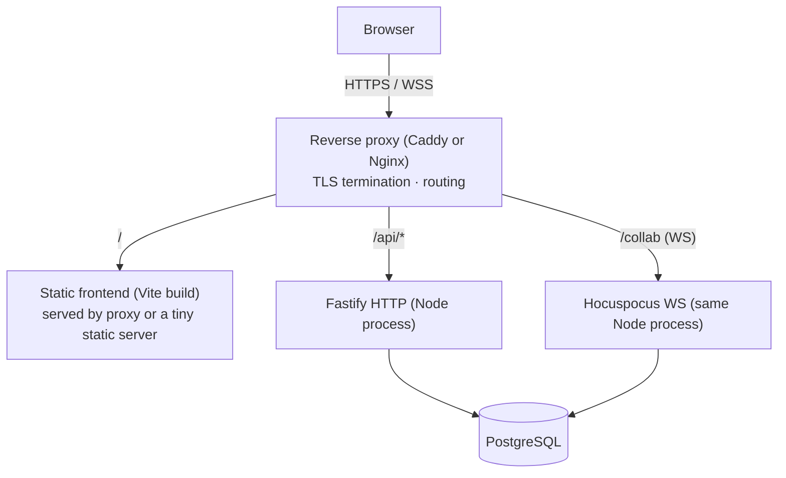

# Infrastructure & Deployment

Right-sized for an interview assignment that must _work reliably_, not for hyperscale. No
Kubernetes, Kafka, RabbitMQ, or microservices — none are justified by the requirements.

## Topology

- **Reverse proxy** terminates TLS and routes: static assets, `/api/*` to HTTP, `/collab`
  WebSocket upgrade to the Hocuspocus endpoint. Caddy is suggested for automatic HTTPS in
  the demo; Nginx is equally fine.
- **One Node process** serves both HTTP and WS (the modular monolith). WebSocket upgrade is
  handled on the same server.
- **PostgreSQL** single instance.
- **No Redis** in MVP (justified in [system-overview.md](system-overview.md)); the seam to
  add it exists if we ever run multiple backend instances.

## Local development

- `docker-compose up` starts Postgres, the backend, and (optionally) the proxy; the
  frontend runs via Vite dev server with HMR, proxying `/api` and `/collab` to the backend.
- One `.env` (from `.env.example`) configures DB URL, JWT/cookie secrets, allowed origins.
- DB migrations run on start (or via a `pnpm db:migrate` script).

## Production deployment

- `docker-compose` with three services (proxy, app, postgres) on a single host is
  sufficient for the assignment and the demo video. Frontend is built to static files and
  served by the proxy.
- Environment separation via distinct `.env` files / secrets; secrets never in the image.
- Backups: Postgres is the only stateful service; a periodic `pg_dump` is enough at this
  scale. Because document content is in Postgres (updates + snapshots), backing up Postgres
  backs up the documents.

## Scaling seams (documented, not built)

If real load ever demanded it: run N backend instances behind the proxy and add **Redis
pub/sub** so a document open on multiple instances shares updates + awareness (Hocuspocus
has an extension for exactly this). Postgres would get read replicas / connection pooling.
None of this is in scope; it is noted so the current design is visibly _not a dead end_.
