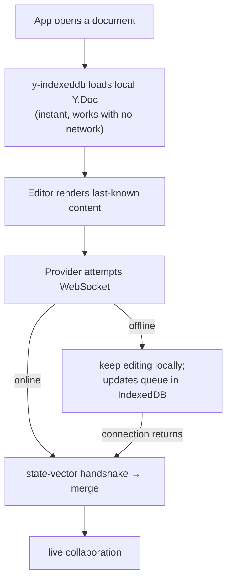
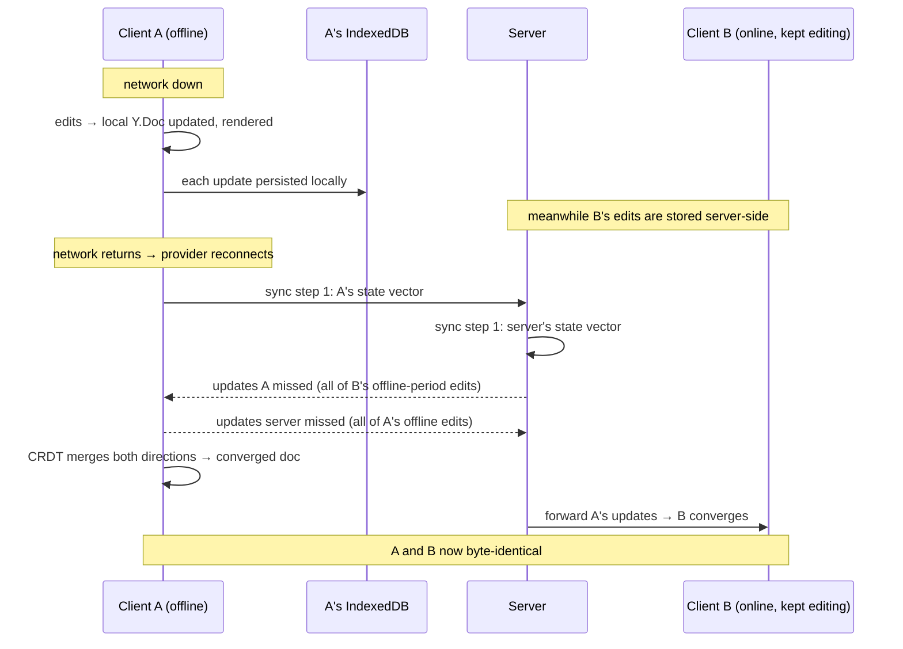

# Offline-First Architecture & Conflict Merge

> This is the most important document. The assignment explicitly says the offline scenario
> is "the part most often done for show" and will get the closest scrutiny. Scribe is
> offline-_first_, not offline-_aware_.

## Principle: local first, network is an enhancement

The client is built so the WebSocket is **optional at every moment**. The load and edit
paths do not depend on it:

There is no separate "offline mode" the user toggles and no separate code path for
offline editing. Editing always writes to the local `Y.Doc`; whether a provider happens to
be connected only affects _when_ those updates reach others.

## Where offline data lives, precisely

- **Store:** the browser's **IndexedDB**, one object store per document, managed by the
  `y-indexeddb` provider.
- **What is stored:** the CRDT itself — a compacted state plus the tail of unmerged binary
  **updates**. Not HTML, not "the latest text". This is the crux: because we persist
  updates, a reconnect can compute a _diff against the server_ and merge. If we had stored
  only rendered content, we could only overwrite — the exact anti-pattern to avoid.
- **What is _not_ stored offline:** awareness/presence (ephemeral), and JWTs live in
  memory + an httpOnly refresh cookie, not in the doc store.

localStorage is deliberately not used; see
[technical-decisions.md](technical-decisions.md#why-localstorage-is-not-used-for-offline-called-out-because-the-spec-demands-it).

## The online and offline lifecycles

**Online:** user edits → local `Y.Doc` changes → `y-indexeddb` persists + WS provider
sends update → server persists + broadcasts → remote clients merge.

**Offline → reconnect:**

The reconnect is not "push my version". It is a **bidirectional diff and merge** driven by
state vectors, so B's concurrent work is pulled _into_ A at the same time A's work is
pushed to B. Nobody's edits are chosen over anybody's — they are combined.

## Conflict scenarios (the required matrix)

For every scenario the same three CRDT guarantees do the work, so we state them once and
then show each scenario resolving to them:

- **G1 Convergence:** replicas that have applied the same update set are identical,
  regardless of order.
- **G2 Idempotence:** applying an update twice = applying it once (duplicate-safe).
- **G3 Intention preservation:** concurrent edits are _both_ kept and deterministically
  ordered; none is dropped or overwritten. There is no "last write wins".

| Scenario                                              | What happens                                                                                                                                  | Why nothing is lost/duplicated/overwritten                                                                                    |
| ----------------------------------------------------- | --------------------------------------------------------------------------------------------------------------------------------------------- | ----------------------------------------------------------------------------------------------------------------------------- |
| **A — Both online, edit together**                    | Updates stream live both ways.                                                                                                                | G1/G3: concurrent inserts interleave deterministically; both sets survive.                                                    |
| **B — A offline edits, B online edits, A returns**    | On reconnect, state-vector exchange trades the missing updates both ways; CRDT merges.                                                        | G1/G3: A's offline edits and B's live edits are combined, not compared.                                                       |
| **C — Both offline, both edit, both return**          | Each reconnect runs its own handshake; server accumulates both update sets and fans out the union.                                            | G1: order of reconnection doesn't matter; final doc is the merge of all updates. G2: any re-sent update is a no-op.           |
| **D — Unstable/flapping connection**                  | Provider buffers to local `Y.Doc`+IndexedDB; on each brief reconnection it flushes queued updates.                                            | G2: partially-sent then re-sent updates are idempotent; no doubling. Edits never blocked.                                     |
| **E — Client reconnects after server restart**        | Server rebuilds `Y.Doc` from snapshot+log (`onLoadDocument`), then the handshake pulls whatever the rebuilt state is missing from the client. | G1: rebuilt server + client converge; the client's IndexedDB is the safety net if the server lost recent unpersisted updates. |
| **F — Client reconnects after a long offline period** | Same handshake; the state-vector diff may be large but is still a _diff_, not a full resend. Merge proceeds normally.                         | G1/G3: long gap is just "many missing updates"; merge semantics are unchanged.                                                |

### Worked micro-example (intention preservation)

Document is `Hello`. A (offline) makes it `Hello world`. B (online) makes it `Hi Hello`.
On A's reconnect, both an insert of ` world` at end and an insert of `Hi ` at start are
present; every replica computes `Hi Hello world`. Neither user's word is lost and neither
overwrote the other — contrast with a last-write-wins system, which would keep only one.

## Edge cases we handle explicitly

- **Same document open in two tabs of one browser.** Both tabs share one IndexedDB store;
  `y-indexeddb` + the provider's cross-tab awareness keep them consistent, and only the
  updates flow to the server. No duplication.
- **Offline document _creation_.** MVP assumes a document must be created online (needs a
  server id + membership row) before offline editing. Creating brand-new documents while
  offline is a future feature; flagged so we don't quietly pretend it works.
- **IndexedDB unavailable** (private mode / blocked): the app still works in-memory for the
  session and warns that offline durability is off — it degrades, it doesn't crash.
- **Storage growth on the client:** `y-indexeddb` compacts its stored updates into a single
  state periodically, so a long-lived local doc doesn't grow unbounded.

## How we _prove_ it (not just claim it)

The offline guarantees are verified by automated tests that script real disconnects and
assert byte-level convergence, plus concurrent-offline-edit tests — see
[testing-strategy.md](testing-strategy.md). The demo video walks scenario B end to end.

## Implementation status (Phase 3 — implemented)

Everything above is now implemented and exercised by tests; this section records the
concrete pieces and the exact deviations, so the doc matches the code.

### Where the code lives

- **Local CRDT durability:** `useCollaboration.ts` constructs one `Y.Doc` + one
  `IndexeddbPersistence` per open document, independent of the WebSocket. IndexedDB
  construction is wrapped in try/catch — if it throws (private mode) the session
  degrades to in-memory and logs a warning rather than crashing (edge case above).
- **Connection state machine:** derived by a pure function
  `connectionState.ts#deriveConnectionStatus`, driven by the Hocuspocus provider's
  socket/sync events **and** the browser's `navigator.onLine` (+ `online`/`offline`
  window events). This is what distinguishes **OFFLINE** (browser reports no network)
  from **RECONNECTING** (network present, socket down, retrying — e.g. a server
  outage), per the matrix's Scenario D / the "server unavailable vs network offline"
  distinction. The function never returns `synced` while `navigator.onLine` is false,
  so "Synced to cloud" cannot be shown while the browser is offline.
- **Reconnect / merge:** the standard `HocuspocusProvider` reconnect + Yjs
  state-vector handshake. There is **no** custom merge, **no** timestamp/`version`
  comparison, and **no** whole-document (HTML/JSON) replacement anywhere in the
  reconnect path. Content only ever moves as binary Yjs updates.

### Deviation: a tiny **metadata** cache for offline document open

Opening a document needs its metadata (title + the caller's role, which gates
viewer read-only) in addition to its CRDT body. That metadata normally comes from
`GET /api/documents/:id`; if the browser reloads while offline that request fails,
which would prevent a _locally-known_ document from opening at all even though its
CRDT is sitting in IndexedDB. So `documents/metadataCache.ts` caches the small
metadata row in `localStorage` and `useDocuments.ts` falls back to it **only** when
the request fails with a network error (never on an authoritative `ApiError` such as
403/404, which is shown as-is so a revoked grant is not masked by stale cache).

This is **not** the forbidden "save the latest HTML/JSON in localStorage" pattern:
no document content is ever stored there — content lives solely in the Yjs CRDT
(IndexedDB locally, Postgres on the server) and still merges via the state-vector
handshake. localStorage holds only `{id, title, role, timestamps}`.

### Known limitation: app-shell offline reload

The CRDT content survives an offline reload (it is in IndexedDB), but a browser
reload **while still offline** also has to re-fetch the app's HTML/JS bundle, which
requires a service-worker / PWA app-shell cache. That caching is **out of MVP scope**
and not implemented; a reload after the network returns restores everything. The
end-to-end test therefore reloads after reconnecting and asserts the offline edit
survived; byte-level IndexedDB durability is additionally covered below the browser
layer.

### The test matrix (what proves each scenario)

| Scenario                         | Proven by                                                                                               |
| -------------------------------- | ------------------------------------------------------------------------------------------------------- |
| B — A offline / B online → merge | `server/test/integration/offline.test.ts` "Scenario B"; e2e "offline editing … survives reconnect"      |
| C — both offline diverge → merge | integration "Scenario C" (reconnect order-independent); e2e "both offline diverge … no last-write-wins" |
| Different-region offline edits   | integration "§8 both offline edit different regions"                                                    |
| Overlapping / same-offset edits  | integration "§9 overlapping offline edits at the same offset"                                           |
| D — connection flapping          | integration "§10 repeated flapping … no loss, no duplication"                                           |
| F — long offline session         | integration "§11 long offline session"                                                                  |
| E — server restart while offline | integration "§12 server restart while A offline"                                                        |
| No last-write-wins guard         | integration "§32 … neither snapshot overwrites the other"                                               |
| Offline editing stays editable   | e2e "offline editing stays editable"                                                                    |
| Offline edit survives reload     | e2e "an offline edit survives a browser reload"                                                         |
| Presence ephemeral on disconnect | e2e "presence disappears … returns on reconnect"; integration "exposes real presence …"                 |

Convergence is asserted as a **property** — equal Yjs state vectors ⇒ identical
document (integration `waitUntilConverged`) — never a hand-picked winning string.
