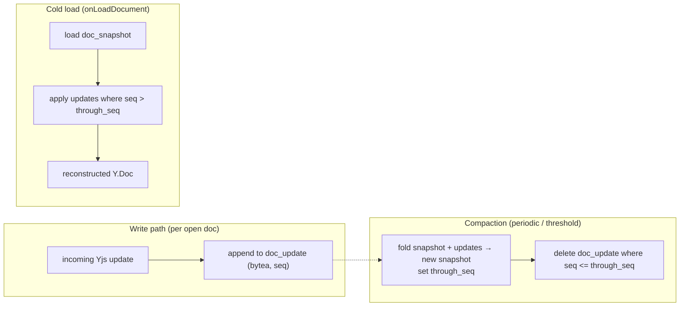

# Document Persistence Strategy

A CRDT document is not "a row of HTML". It is a set of binary updates that merge into a
state. The persistence question is: how do we store that durably so documents survive
restarts, load fast, and don't grow forever?

## Options considered

| Approach                                        | How                                                                                   | Pros                                            | Cons                                                                     |
| ----------------------------------------------- | ------------------------------------------------------------------------------------- | ----------------------------------------------- | ------------------------------------------------------------------------ |
| **Single blob, rewritten**                      | Store the whole encoded `Y.Doc` each save                                             | Trivial load                                    | Write amplification; a save race can drop concurrent updates; no history |
| **Updates only (append log)**                   | Append every binary update forever                                                    | Never loses an update; simple writes            | Cold load replays _everything_ → slow + unbounded growth                 |
| **Snapshot only, periodic**                     | Overwrite a full-state row every N seconds                                            | Fast load; bounded                              | Updates between snapshots lost on crash                                  |
| **Update log + periodic snapshots (hybrid)** ✅ | Append updates; periodically fold them into one snapshot and truncate the folded tail | Fast cold load, bounded storage, no update loss | Slightly more code (compaction)                                          |

**Chosen: the hybrid.** It is the standard robust pattern and it directly serves the graded
requirements (restart recovery + no data loss) without a distributed system.

## How it works

- **Write:** every update the server receives is appended to `doc_update` in the same flow
  that broadcasts it. Writes are cheap inserts, batched under load.
- **Snapshot / compaction:** triggered by a threshold (e.g. every N updates or T seconds,
  and once when the last client disconnects). The server merges the current snapshot with
  the accumulated updates into a fresh snapshot, records `through_seq`, and deletes the
  folded updates in one transaction. This bounds both storage and cold-load time.
- **Cold load:** `onLoadDocument` loads the snapshot and applies only updates newer than
  `through_seq`, reconstructing the exact `Y.Doc`.

Hocuspocus's persistence hooks (`onLoadDocument` / `onStoreDocument`) are the integration
points; we implement them against Postgres with the schema in
[data-model.md](data-model.md).

## Addressing each required concern

- **Recovery after server restart:** the in-memory doc is just a cache. On the next
  connection `onLoadDocument` rebuilds it from Postgres. The only at-risk data is updates
  received but not yet flushed; we mitigate by appending updates synchronously in the
  receive path (not on a lazy timer) and by the client's IndexedDB holding its own copy,
  which the reconnect handshake will re-offer. Net: no user-visible loss.
- **Document loading:** snapshot + tail replay — O(size + recent edits), not O(all history).
- **Synchronization:** load reconstructs the authoritative state vector the sync handshake
  needs; nothing special beyond that.
- **Storage growth:** bounded by compaction; the log is truncated on every snapshot.
- **Consistency:** compaction runs in a single transaction (write new snapshot + delete
  folded updates) so a crash mid-compaction leaves either the old snapshot+log or the new
  snapshot — never a gap.
- **Performance:** appends are fast; snapshots are periodic and off the hot path; cold load
  touches two indexed queries.

## MVP scope guardrails

- Compaction is a simple in-process scheduled task, **not** a separate service.
- We store CRDT updates as `bytea`; we do **not** try to keep a parsed relational
  representation of document content in sync — that would reintroduce a lossy translation.
- Snapshots are _not_ exposed as user-facing version history in MVP (that's a future
  feature that this structure happens to enable later).
