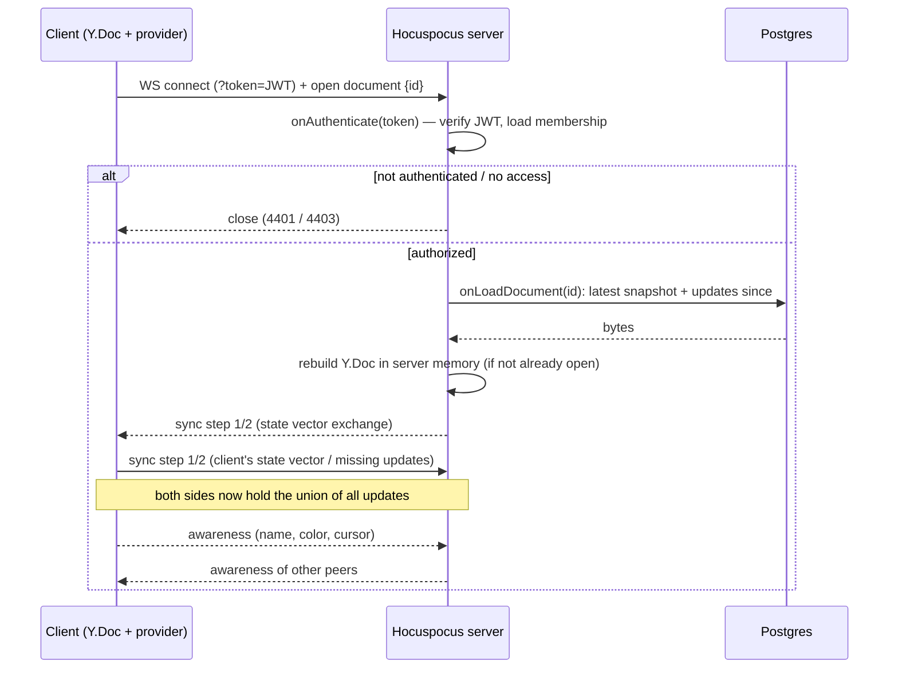
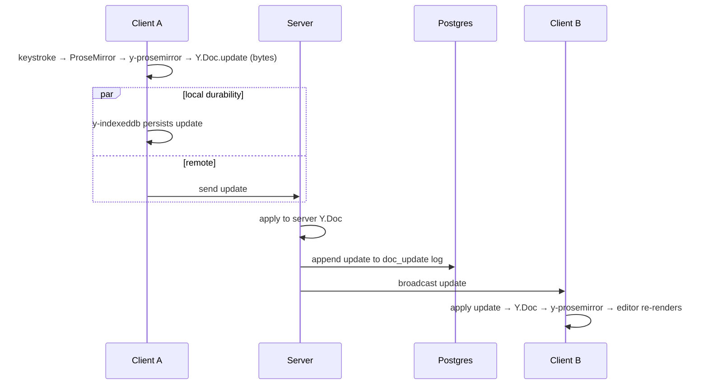
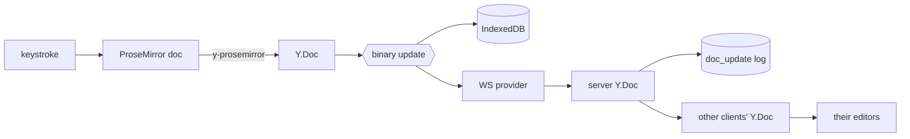

# Real-Time Collaboration

## What "real-time" means here

Every edit is applied to the **local** `Y.Doc` first and rendered immediately — the user
never waits for the network. The edit then propagates as a small binary update. Remote
edits arrive as updates and are merged into the local `Y.Doc`, which the editor re-renders.
There is no request/response round trip on the typing path and no locking.

## Connection & join protocol

The client uses one `HocuspocusProvider` per open document. Connecting and joining are a
single flow (Hocuspocus multiplexes documents over one WebSocket by document name):

The **sync protocol** is Yjs's two-step diff: each side sends a compact _state vector_
(a summary of "which updates I already have, per client"), and each side replies with only
the updates the other is missing. This is why joining a huge document, or reconnecting
after being away, transfers a _diff_, not the whole document.

## Live edit propagation (steady state, two clients online)

Key properties that satisfy "no lost or duplicated changes":

- **Commutative + idempotent merge.** Yjs updates can arrive in any order and be applied
  more than once; the resulting document is identical. A duplicated broadcast is a no-op,
  not a doubled edit.
- **No server transform step.** Unlike OT, the server does not rewrite operations against
  each other. It stores and forwards bytes. Less server logic = fewer places to be wrong.
- **Client identity, not position.** Each client has a Yjs client id; concurrent inserts
  are ordered deterministically by (id, clock), so two people typing at the same offset
  produce a stable interleaving on _every_ replica rather than one clobbering the other.

## Presence / awareness (separate channel)

Presence is handled by Yjs **Awareness**, which is deliberately _not_ part of the document
CRDT and is **never persisted**:

- Each client sets a local awareness state: `{ user: { name, color }, cursor: {anchor, head} }`.
  Colors come from the design system's presence tokens (`#10B981`, `#F43F5E`, `#F59E0B`,
  `#8B5CF6`, …).
- Awareness updates are broadcast over the same WebSocket but on the awareness channel.
- `y-prosemirror`'s cursor plugin renders remote **cursors and selections** directly from
  awareness — the flagged caret and the peer-colored selection highlight (14% opacity) in
  the design.
- Awareness has a **timeout**: if a peer stops sending heartbeats (tab closed, crashed,
  disconnected) their state expires and their avatar/cursor disappears automatically. No
  server-side "user left" bookkeeping is required.

This is why presence and content are treated differently everywhere in the system
(see [data-model.md](data-model.md)): content must survive forever and merge; presence is
throwaway and should vanish when you leave.

## Disconnect / reconnect / server-restart handling

These are the scenarios graded most closely. All of them reduce to the same mechanism:
**a reconnecting client and the server exchange state vectors and trade only the missing
updates.** Full detail and the conflict matrix live in
[offline-sync.md](offline-sync.md); the transport-level behavior:

- **Disconnect:** the provider detects socket loss, flips the sync state to
  `OFFLINE`/`RECONNECTING`, and **keeps buffering edits into the local `Y.Doc` and
  IndexedDB**. Editing never stops.
- **Reconnect:** exponential backoff with jitter. On success the sync handshake runs
  again; anything the client did offline is sent up, anything it missed comes down, both
  converge.
- **Server restart:** server memory is empty, but `onLoadDocument` rebuilds the `Y.Doc`
  from Postgres (snapshot + update log). The reconnecting client's state vector then pulls
  exactly what the rebuilt server is missing. No client action needed beyond reconnecting.
- **Unstable connection:** because local edits are authoritative locally and updates are
  idempotent, flapping just means updates are exchanged in bursts; nothing is lost or
  double-applied.

## Data-flow summary

The takeaway: content only ever moves as **Yjs updates**, and the _same_ update object is
what gets rendered, persisted locally, sent, stored server-side, and fanned out. One
representation, no lossy conversions.
