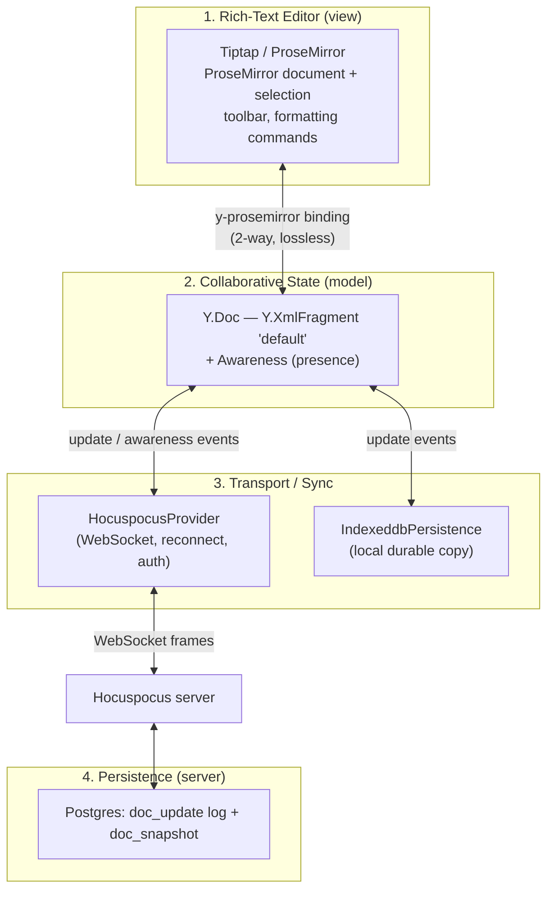
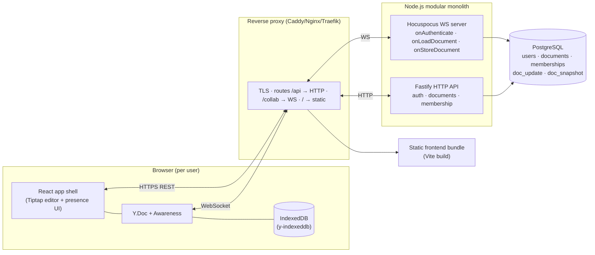

# System Overview

## The core idea: one CRDT model, four locations

The defining decision in Scribe is that **the collaborative document is a single Yjs
document (`Y.Doc`) that lives in four places simultaneously**, and all four are kept in
sync by exchanging small binary _updates_, never by shipping HTML:

```
              ┌───────────────────────── the SAME Y.Doc, four copies ──────────────────────────┐
   Client A (RAM)  ⇄  Client A IndexedDB        Server RAM (per open doc)  ⇄  Postgres (updates + snapshots)
   Client B (RAM)  ⇄  Client B IndexedDB              ▲
        ▲                                             │ WebSocket (binary Yjs updates + awareness)
        └───────────────── WebSocket ─────────────────┘
```

Because every copy is the _same CRDT_, merging is not a policy we invent — it is a
mathematical property of the data type. Two clients that have seen the same set of updates
(in any order, with any duplicates) compute the **same document**. That is what makes the
offline story real rather than "save a copy of the latest HTML".

## The four layers, strictly separated

The assignment requires separating editor / collaborative state / transport / persistence.
Scribe enforces this as four layers with narrow interfaces:



- **Layer 1 — Editor (view).** Tiptap owns _how text looks and how you edit it_: the
  ProseMirror schema (paragraph, heading, bullet/ordered list, bold/italic marks), the
  floating toolbar, keyboard shortcuts. It knows nothing about the network.
- **Layer 2 — Collaborative state (model).** A `Y.Doc` holding a `Y.XmlFragment` is the
  _single source of truth for content_. Awareness (a separate, ephemeral Yjs channel)
  holds presence. This layer knows nothing about editing UI or transport.
- **Layer 3 — Transport/sync.** Two Yjs "providers" observe the `Y.Doc` and move updates:
  `y-indexeddb` (local durability) and the Hocuspocus WebSocket provider (remote sync).
  Providers are additive and independent — offline works with zero providers reachable.
- **Layer 4 — Persistence.** The server stores the byte-level updates and periodic
  snapshots so a document survives restarts and can be rebuilt from cold.

The bridges between layers are off-the-shelf and lossless: `y-prosemirror` maps the
ProseMirror doc ⇄ `Y.XmlFragment` bidirectionally; the providers map `Y.Doc` update
events ⇄ their storage/wire format. **No layer serializes the whole document to move a
change** — they exchange incremental updates.

## High-level runtime architecture



There is **one backend process** (a modular monolith), not microservices. HTTP and
WebSocket are two entry points into the same process sharing the same database and domain
services. Redis is **not** in the MVP (see below).

## Responsibilities at a glance

| Component                    | Owns                                                      | Explicitly does _not_ own    |
| ---------------------------- | --------------------------------------------------------- | ---------------------------- |
| React shell                  | Layout, routing, the design system                        | Document merge logic         |
| Tiptap editor                | Schema, formatting commands, rendering                    | Networking, persistence      |
| Y.Doc                        | Canonical content + merge                                 | How content is displayed     |
| Awareness                    | Presence (name, color, cursor) — _ephemeral_              | Anything durable             |
| `y-indexeddb`                | The client's durable offline copy                         | Remote sync                  |
| Hocuspocus provider (client) | Connect, join doc, send/receive updates, reconnect        | Content semantics            |
| Fastify API                  | Auth, document CRUD metadata, membership checks           | Live editing                 |
| Hocuspocus server            | Auth on connect, fan-out updates, load/store CRDT         | Business rules beyond access |
| Postgres                     | Durable users/docs/memberships + CRDT updates & snapshots | Live fan-out                 |

## Why no Redis in the MVP

Redis is commonly added to Yjs backends for two reasons: (1) horizontal scaling — fanning
updates across multiple server instances via pub/sub, and (2) shared awareness across
instances. The MVP runs **a single backend instance**, so a document is only ever open on
one process and in-process fan-out is sufficient. Introducing Redis now would add
infrastructure with no requirement behind it, violating our simplicity principle. The
architecture leaves a clean seam (the Hocuspocus persistence/scaling extensions) to add
Redis pub/sub later _if and only if_ we need to run multiple instances.

## End-to-end request lifecycles

**Open a document (online):** REST `GET /api/documents/:id` returns metadata and confirms
access → client opens a `HocuspocusProvider` for that doc id with a JWT → server
`onAuthenticate` verifies the token and membership → server `onLoadDocument` rebuilds the
`Y.Doc` from snapshot+updates → server sends the current state → client's local
IndexedDB copy and the server copy sync → Tiptap renders. Meanwhile `y-indexeddb` may have
already rendered the last-known content _before_ the socket even connects (offline-first
load).

**Type a character:** Tiptap mutates the ProseMirror doc → `y-prosemirror` writes the
delta into the `Y.Doc` → the `Y.Doc` emits one small `update` (bytes) → both providers
receive it: `y-indexeddb` persists it locally, the WS provider sends it to the server →
server applies it, persists it (log), and broadcasts to other clients on that doc → their
`Y.Doc`s apply it → their editors update. No HTML crosses the wire; a single-character
edit is on the order of tens of bytes.

See [realtime-collaboration.md](realtime-collaboration.md) and
[offline-sync.md](offline-sync.md) for the detailed flows.

## Implementation status: Phase 3 (offline + reconnect + conflict-free merge)

The architecture above is now fully live. Build order:

- **Phase 0** — foundation: auth, document metadata API + CRUD, app shell, design system.
- **Phase 1** — the real Tiptap/ProseMirror editor (Layer 1), with a temporary local-only
  persistence bridge.
- **Phase 2** — collaboration: Layers 2–4 implemented. Editing is real-time and multi-user,
  backed by Yjs, Hocuspocus, and Postgres. The Phase 1 localStorage bridge is **removed**.
- **Phase 3** — the full offline conflict matrix is **implemented and tested**: offline
  editing stays editable, edits persist in IndexedDB and survive reload, and reconnect
  merges local + remote via the Yjs state-vector handshake with no last-write-wins, no
  custom merge, and no whole-document overwrite. Details in
  [offline-sync.md](offline-sync.md#implementation-status-phase-3--implemented) and
  [connection-states.md](connection-states.md#implementation-phase-3).
- **Phase 4** — durability & security hardening of the above, **without** changing the
  architecture (same web/server/db, no Redis): stateful refresh-token rotation + reuse
  detection + session revocation, HTTP body / WebSocket frame size caps, per-IP + per-user
  rate limiting, structured secret-free security logging, and crash-safe transactional
  persistence + compaction. See [security.md](security.md#implementation-status-phase-4) and
  [ADR-0009](adr/0009-refresh-rotation-and-abuse-limits.md).
- **Phase 5** — sharing & product polish, again **without** re-architecting (same web/server/db,
  no Redis, no new service, Yjs unchanged): a real user-facing Share flow backed by a
  server-side membership API (list/add/change-role/remove) + user search, all authorized
  against the existing `memberships` table; owner/editor/viewer semantics with an owner
  invariant; dashboard grouping into owned vs. shared. See
  [security.md](security.md#implementation-status-phase-5--sharing) and
  [ADR-0010](adr/0010-sharing-membership-api.md).

### Sharing / membership API (Phase 5)

The Fastify API gains a membership surface under the document it belongs to:
`GET/POST /api/documents/:id/members` and `PATCH/DELETE /api/documents/:id/members/:userId`,
plus `GET /api/users/search`. These write only the `memberships` table (never document
content) and reuse the exact same authorization primitive as everything else
(`getDocumentForUser` → the caller's role). Only the owner may mutate sharing; any member may
list. This is the same modular monolith — a new module (`modules/memberships`), not a new
service.

### What Phase 2 implements

- **Tiptap ⇄ Y.Doc (Layer 1↔2).** The editor binds to a per-document `Y.Doc` via
  `@tiptap/extension-collaboration` (+ `@tiptap/extension-collaboration-cursor` for remote
  carets). The Y.Doc is the single source of truth for content; it is never mirrored into
  React/Zustand. StarterKit's local history is disabled — undo/redo is Yjs' `UndoManager`,
  scoped to the local user (one user's undo never reverts another's edit). The shared editor
  schema lives in `@scribe/shared` so the browser and the server's seeding path agree exactly.
- **Transport (Layer 3).** A `HocuspocusProvider` per open document connects over WebSocket to
  `/collab`. `y-indexeddb` persists the Y.Doc locally (fast reload; groundwork for offline).
  The provider lifecycle (create/destroy on document switch, no leaked sockets) lives in
  `features/collaboration/useCollaboration.ts`, isolated from the editor UI.
- **Server (Layer 3/4).** Hocuspocus runs **in the same Fastify process and port** (upgrade on
  `/collab`; no second service, no Redis). `onAuthenticate` verifies the JWT and membership —
  reusing the same token + membership repo as REST — before any document loads or update is
  accepted; viewers connect read-only. `onLoadDocument` reconstructs the Y.Doc from Postgres
  (snapshot + update-log tail) or seeds a brand-new document once, server-side. `onChange`
  appends each update to `doc_update`; `onStoreDocument` compacts into `doc_snapshot`. Content
  is stored only as binary Yjs state — never HTML or JSON.
- **Presence.** Real Yjs awareness carries each user's id/name/color; the header shows live
  collaborators and remote cursors, which vanish on disconnect. Presence is never persisted.
- **Sync status.** The header pill is driven by real provider events (`connecting` → `syncing`
  → `synced`, `offline`/`reconnecting`, `error`) — "Synced to cloud" means actually synced.

### WebSocket authentication (decision)

The browser authenticates the socket with the **short-lived access token only**, supplied to
the provider as an async `token` callback that returns the in-memory token and silently
refreshes it (via the httpOnly refresh cookie) when it is missing or near expiry. The refresh
token is never exposed to the WebSocket layer — not in the URL, a message, or storage. On
(re)connect the provider requests a fresh token, so expiry is handled without a second auth
system and without an infinite loop (auth failure surfaces as an `error` status, not a retry
storm).

### Persistence model & compaction scope

The hybrid update-log + snapshot design (persistence.md) is implemented: updates are appended
synchronously in the change path (crash-safe), and a snapshot is written on a debounce and on
last-disconnect, truncating folded updates in one transaction. A **time-based background
compactor is intentionally deferred to a later phase** — snapshot-on-unload already bounds the
log for the MVP; this is documented rather than silently skipped.

### Phase 3 scope (complete)

The full offline story is now implemented and tested: offline editing (editor stays
editable with the socket down), reconnect via the Yjs state-vector handshake,
divergent/simultaneous/overlapping offline edits, connection flapping, long offline
periods, server-restart-during-offline, offline-open of a locally-known document via a
content-free metadata cache, and a truthful OFFLINE/RECONNECTING/SYNCING/SYNCED state
machine. The scripted convergence matrix from [offline-sync.md](offline-sync.md) runs as
real integration tests (Yjs + Hocuspocus + WebSocket + Postgres) and Playwright
multi-context E2E (real browsers + IndexedDB + real network offline).

Out of MVP (unchanged, flagged not silently skipped): offline document **creation** (needs
a server-issued id + membership first), a service-worker app-shell cache for reloading
while still offline, a time-based background compactor (snapshot-on-debounce/unload still
bounds the log), and multi-instance scaling (Redis pub/sub).
