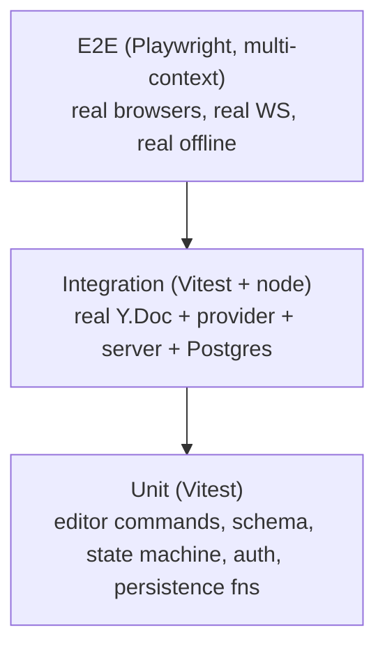

# Testing Strategy

Testing is a grading criterion, and the risky behavior is concurrency/offline/merge — not
"does bold work". The strategy weights tests toward the guarantees that are easy to get
subtly wrong. The rule: **prove convergence, don't assume it.**

## The pyramid, adapted



Most _logic_ is unit-tested; most _risk_ is covered by a smaller number of high-value
integration/e2e tests that script disconnects and assert byte-level convergence.

## Unit tests

| Area                  | Examples                                                                                                         |
| --------------------- | ---------------------------------------------------------------------------------------------------------------- |
| Editor formatting     | bold/italic toggle marks; heading level set; bullet vs. ordered list transforms; schema rejects disallowed nodes |
| Sync state machine    | every transition table entry; edits never blocked; offline is non-error; debounce logic                          |
| Persistence functions | snapshot+log fold reconstructs identical `Y.Doc`; compaction truncates correctly; single-transaction consistency |
| Auth                  | JWT verify/expiry; refresh rotation + reuse detection; Argon2id hashing                                          |
| Update validation     | malformed/oversized Yjs update is rejected without throwing                                                      |

## Integration tests (the core of the suite)

Run against a real `Y.Doc`, real providers, a real server, and a real (ephemeral/Docker)
Postgres. These encode the required scenarios from
[offline-sync.md](offline-sync.md):

- **Two-client concurrent edit → identical final state.** Spin up two `Y.Doc`s + providers
  on one server doc, apply interleaved edits, assert `encodeStateAsUpdate(A) == B` and
  identical rendered text.
- **Offline merge (Scenario B).** Disconnect provider A, edit A and B independently,
  reconnect A, assert both converge and _both_ edits are present.
- **Concurrent offline (Scenario C).** Both offline, both edit, both reconnect in each
  order; assert order-independence.
- **Repeated / flapping reconnect (Scenario D).** Toggle the socket rapidly during edits;
  assert no lost/duplicated content (idempotence).
- **Server restart (Scenario E).** Kill + restart the server process; client reconnects;
  assert the doc reconstructs from Postgres and converges.
- **Long offline (Scenario F).** Large offline diff; assert correct merge and that a diff
  (not full doc) was exchanged.
- **Persistence round-trip.** Write updates → compact → cold-load → assert identical doc.
- **Authorization.** Non-member WS connect is rejected; viewer cannot write; forbidden REST
  returns 404.

## End-to-end tests (Playwright, multiple browser contexts)

Real browsers, real WebSocket, real IndexedDB, using Playwright's network-offline control —
this is what proves the demo scenario for real:

```mermaid
sequenceDiagram
  participant A as Browser context A
  participant B as Browser context B
  A->>A: open doc, type "Hello"
  B->>B: open same doc → sees "Hello"
  A->>A: context.setOffline(true); type " world"
  B->>B: (online) type "Hi " at start
  A->>A: context.setOffline(false)
  Note over A,B: assert BOTH show "Hi Hello world"
```

- **Live collaboration:** A and B in the same doc; A types, B sees it < ~200ms; remote
  cursor/selection of A is visible to B with the right name/color.
- **Offline scenario (the graded one):** exactly the sequence above — go offline, edit on
  both sides, come back, assert convergence in the actual DOM.
- **Presence:** peer avatar appears on join and disappears on close (awareness timeout).
- **Reload durability:** edit offline, reload the tab while still offline, assert content
  survived (IndexedDB), then reconnect and assert merge.
- **UI smoke:** toolbar formatting reflects in the rendered document; design-system
  elements render.
- **Media & comments (this phase):** insert an image → it renders → delete it → a second
  user sees the change; a non-member/viewer cannot upload or fetch media; add a comment →
  it highlights and appears for a collaborator → survives editing around it → resolve →
  viewer read-only; export does not leak comment text. See
  [media-and-comments.md](media-and-comments.md).

## Media & comments coverage (by layer)

- **Server (integration + unit):** upload authorization by role (viewer 403 / non-member
  404), content-sniffed MIME (executable/HTML/SVG/oversized rejected), UUID storage keys +
  path-traversal rejection, metadata persistence, membership-scoped serving, forged and
  cross-document `mediaId` → 404 (`test/integration/media.test.ts`,
  `src/modules/media/imageSniff.test.ts`, `storage.test.ts`).
- **Shared/web (unit):** media node + comment mark schema round-trips; export maps media to
  a reference and **excludes** comments; comment anchor apply/resolve/delete and survival
  under text edits (ProseMirror mapping); two-replica convergence; PDF/DOCX image embed +
  placeholder (`comments.test.tsx`, `export/*.test.ts`, shared `editor`/`exportModel`
  tests).

## What is unit vs. integration vs. e2e — the guideline

- **Unit** when the thing is a pure function or a single module (formatting command, state
  transition, a persistence helper).
- **Integration** when correctness _emerges from two or more Yjs replicas + a server +
  DB interacting_ — i.e. all the convergence/merge guarantees. This is where the assignment
  is won or lost, so it gets the most attention.
- **E2E** when the browser environment itself matters — real IndexedDB, real WebSocket, real
  offline toggling, real rendering — i.e. the demo scenarios and presence.

## Collaboration correctness matrix

The full scenario → expected-result → proving-test matrix for the collaboration/CRDT
guarantees (online/offline/reconnect-order/duplicate/out-of-order/restart/permission/
snapshot-replay/structural-convergence) lives in
[collaboration-correctness-contract.md §9](collaboration-correctness-contract.md#9-correctness-matrix-scenario--expected--proof).
That document is the authoritative statement of what the sync layer guarantees, the exact
durability boundary, and the forbidden patterns; this file describes the test _method_, it
describes the test _coverage_.

Two browser-level convergence assertions exist (see the contract §10): `expectConverged`
(visible text) and `expectStructurallyConverged` (canonical logical document JSON — marks,
attributes, page breaks, list structure — via the dev-only probe in `collabDiagnostics.ts`),
so a formatting/structure divergence cannot pass as converged just because the text matches.

## CI

Runs unit + integration on every push (Postgres via a service container); e2e on a
schedule/PR gate (slower, needs browsers). Determinism for concurrency tests comes from
controlling update delivery order in integration tests rather than sleeping.
